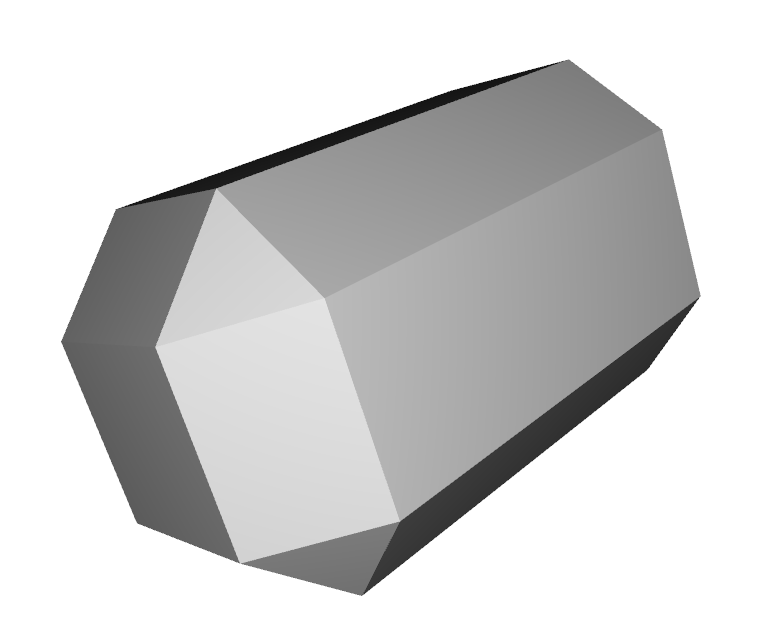

# Marching Cubes Python

Simple python implmentation of Marching Cubes algorithm based on c# implmentation here: https://github.com/Scrawk/Marching-Cubes

## TODO

Experiments in parallelisation, gpu compute and cython to find reasonable speed/complexity tradeoff for reasonably small (tabletop) scenes

